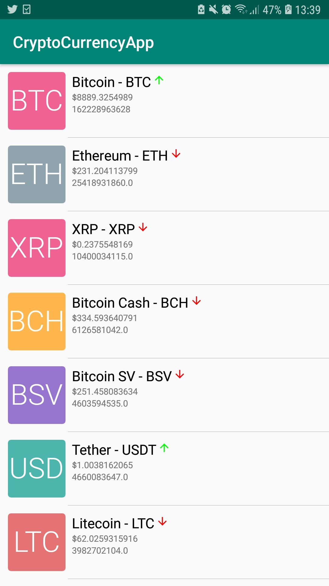
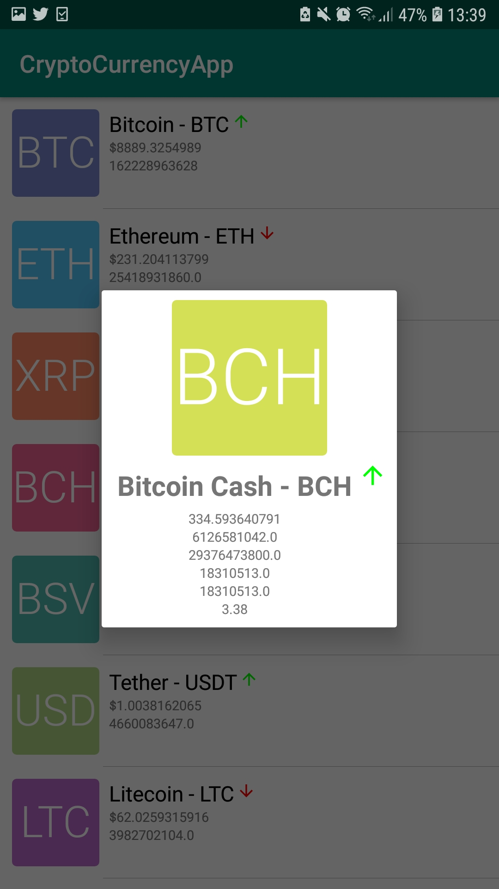
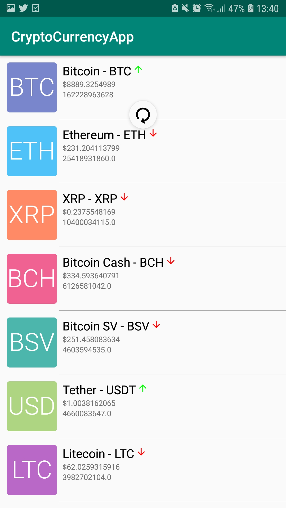
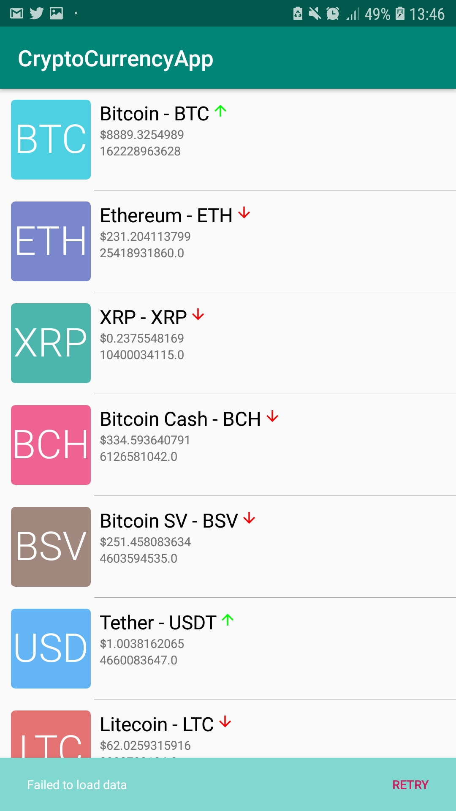

# CryptoCurrencyApp
# CryptoCurrencyApp for fetching CryptoCurrency data from an end-point, https://api.coinmarketcap.com/v1/ticker/?limit=50; and displaying the data on the UI, using a RecyclerView.
# Uses Jetpack's paging library for feeding data into the RecyclerView.
# Uses RoomDB for local caching, and depending on network state, fetches data either from the above api or from the local storage.
# Without internet connection, it shows the cached data, displaying a snackbar at the bottom with an option to retry loading the data 

